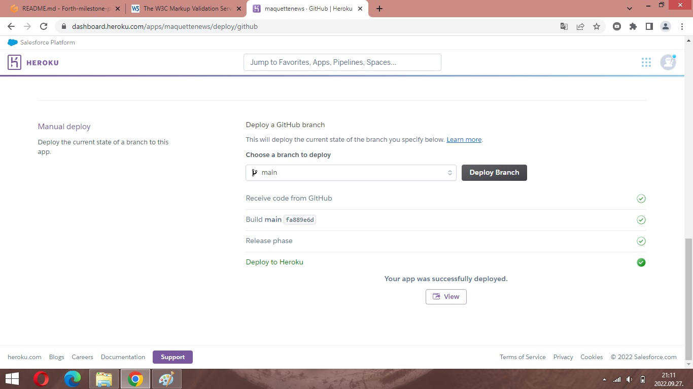

# Bitcoin – currency of matrix

Crypto currencies are very popular, many people mine them, but even more people trade them. This inspired me to develop the project and use predictive analytics. In predictive analytics, there is the possibility of extracting different information from the available data and databases, thereby creating the opportunity to reach a wide range of customers. In my opinion, this field will develop dynamically in the future, on the one hand thanks to increasingly diverse and more easily accessible databases, and on the other hand thanks to the performance of more advanced computers.

## What does this website do?

The purpose of the project is to help a friend of mine find answers who wants to trade Bitcoin among the crypto currencies in the future.

For link to this website click [Here](https://.herokuapp.com/).

# Planning Phase

## Business requirements

A friend of mine has a successful business and has been making a lot of money recently. She would invest part of her savings in cryptocurrency, particularly in Bitcoin. She decided on Bitcoin because it is the cryptocurrency that has been "mined" for the longest time and is mined in the main cryptomines (e.g. USA, Kazakhstan, Russia, etc.). In her opinion, the price of Bitcoin will rise significantly in the next period. She asked me to look for answers to his questions from the database available to her. Her database is open-sourced and shared only with me for this project.

### The project goals are:
- Verify the client's assumption that the daily opening price is always lower than the closing price, so it is worth selling the cryptocurrency at the end of the day.

- To prove that as the exchange rate rises, the difference between the opening and closing value will be smaller than with a lower exchange rate.

## Dataset Content

The dataset is sourced from Kaggle. I created a fictitious user story where predictive analytics can be applied in a real project in the future workplace.
The dataset has 2786 rows and represents bitcoin market data between 14/Mar/2014 – 29/Oct/2021. Each row represents a date between 14/Mar/2014 – 29/Oct/2021, each column contains different information about exchange. The data set includes information about:
-	Open and closing prices which are show how the exchange rate developed during the given day;
-	The highest and lowest exchange rate value during the given day.

|      Variable        	|                      Meaning           	         |       Units 	     |   	
|---------------------	|--------------------------------------------------  |----------------   |
| Date                	| Given date of day 	                             | Date  	         |
| Closing Price (USD) 	| exchange rate value when the market closed  	     | 109,58 - 63347,80 |   	
| 24h Open (USD)     	| exchange rate value when the market opened 	     | 109,58 - 63563,67 |
| 24h High (USD) 	    | the highest value of exchange rate on the given day| 119,67 - 64802,79 |
| 24h Low (USD)     	| the lowest value of exchange rate on the given day | 84,33 - 62095,63  |

## Project Terms and Jargon
-	Exchange rate: the value of rate between Bitcoin and USD on the given day
-	Open and closing prices: the value of Bitcoin in USD at market open and close on that day

## Hypothesis and how to validate?

1.	The opening price is lower than the closing price.
	Validation: This will be validated with a correlation study and use diagrams for visualisation.

2.	As the exchange rate rises, the difference between the opening and closing value will be smaller than with a lower exchange rate.
    Validation: This will be validated with a correlation study. Use diagrams for visualisation.

## The rationale to map the business requirements to the Data Visualizations and ML tasks

### Business Requirements 1 – Data visualisation and correlation study

-	I will inspect the opening and closing value of exchange rate
-	I create the difference between the two values for each day
-	I will conduct a correlation study to understand better the correlation to the expectation of client
-	I will plot the trends of differences in diagrams

### Business Requirements 2 - Data visualisation and correlation study

-   I will inspect the difference between the opening and closing value on 1st January and 31th December in every year
-   I will make an annual comparison of these data with a correlation study
-   I will plot the annual values in a diagram

## Dashboard design
The structure of dashboard follow the list as you find below:
-	### Page 1: Short project summary
        - This page is showing the dataset summary and the business requirements as well as the terms of jargons for better understanding.

        - Client's requirements:
            - Verify the client's assumption that the daily opening price is always lower than the closing price, so it is worth selling the cryptocurrency at the end of the day.
            - To prove that as the exchange rate rises, the difference between the opening and closing value will be smaller than with a lower exchange rate.

        - Description of project dataset:
            - The dataset is sourced from Kaggle. I created a fictitious user story where predictive analytics can be applied in a real project in the future workplace.
            - The dataset has 2786 rows and represents bitcoin market data between 14/Mar/2014 – 29/Oct/2021. Each row represents a date between 14/Mar/2014 – 29/Oct/2021, each column contains different information about exchange. The data set includes information about:
                -	Open and closing prices which are show how the exchange rate developed during the given day;
                -	The highest and lowest exchange rate value during the given day.

        - Terms and jargons of the project:
            -	Exchange rate: the value of rate between Bitcoin and USD on the given day
            -	Open and closing prices: the value of Bitcoin in USD at market open and close on that day

-	### Page 2: displaying how I used data analytics to solve the business requirement
        It will answer business requirement 1
        - Lists the findings related to the inspection of the opening and closing value of exchange rate
        - Checkbox 1: Differences between opening and closing value of exchange rate
        - Checkbox 2: Plot the trend of differences in a diagram

-	### Page 3: displaying how I used ML to solve the business requirement
        It will answer business requirement 2
        - Lists the findings related to the inspection of the difference between the opening and closing value on 1st January and 31th December in every year
        - Checkbox 1: Differences between annual comparison of the aformentioned data
        - Checkbox 2: Plot the annual values in a diagram

-	### Page 4: Project hypothesis and validation
            - Display every hypothesis and their validations

-	### Page 5: ML performance metrics
            - A technical page which is displaying the model performance

## Unfixed bugs

## Deployment
The steps of the publishing on the Heroku were as follow:
    
    1. I created an app name and set the location (Europe)
    2. In the **"Settings"** I managed the config vars part

    3. In the buildpacks I chose heroku/python
    4. In the Deploy section I create a connection between GitHub and Heroku
    5. With the Deploy Branch button I created a deployed app

    6. The website was published on Heroku Page and the link was provided in the same section.

## Main Data Analysis and Machine Learning Libraries
- jupyter notebook - used for writing and running the ML pipelines
- numpy - used for array manipulation
- pandas - used to structure the data
- matplotlib - for creating the charts and plots for data visaulization
- seaborn - used in conjuction with matplotplib for data visualization
- plotly - used for ploting charts for data visualization
- streamlit - for the dashboard development
- scikit-learn - used for data processing

## Other Frameworks, Libraries & Programs Used
Git - used for version control by utilizing the Gitpod terminal to commit to Git and Push to GitHub
GitHub: - used to store the projects code after being pushed from Git
GitPod - Workspace used for the project
AmIResponsive - Used to generate responsive image used in README file
Heroku - Deployment platform for the project

## Credits
### Content:
    - Code Institute course materials
    - Code Institute Slack Community for some helps
    - Code Institute Mentor meetings and support
    - Code Institute tutor support
### Media:
    - Am I Responsive for a responsive image in README 
    - I took pictures 
    - I took the placeholder picture

## Acknowledgements
I would like to thank my family and especially for my wife who support me and sometimes pressured me to learn.
I would like to thank also my mentor, Marcel Mulders for his support, guidance and feedbacks throughout the course of the project.

## Gitpod Reminders

To log into the Heroku toolbelt CLI:

1. Log in to your Heroku account and go to *Account Settings* in the menu under your avatar.
2. Scroll down to the *API Key* and click *Reveal*
3. Copy the key
4. In Gitpod, from the terminal, run `heroku_config`
5. Paste in your API key when asked

You can now use the `heroku` CLI program - try running `heroku apps` to confirm it works. This API key is unique and private to you so do not share it. If you accidentally make it public then you can create a new one with _Regenerate API Key_.

## Dataset Content
* Describe your dataset

## Business Requirements
* Describe your business requirements

## Hypothesis and how to validate?
* List here your project hypothesis(es) and how you envision validating it (them) 

## The rationale to map the business requirements to the Data Visualizations and ML tasks
* List your business requirements and a rationale to map them to the Data Visualizations and ML tasks

## ML Business Case
* In the previous bullet, you potentially visualized an ML task to answer a business requirement. You should frame the business case using the method we covered in the course 

## Dashboard Design
* List all dashboard pages and their content, either blocks of information or widgets, like buttons, checkboxes, images, or any other item that your dashboard library supports.
* Later, during the project development, you may revisit your dashboard plan to update a given feature (for example, at the beginning of the project you were confident you would use a given plot to display an insight but subsequently you used another plot type).

## Unfixed Bugs
* You will need to mention unfixed bugs and why they were not fixed. This section should include shortcomings of the frameworks or technologies used. Although time can be a significant variable to consider, paucity of time and difficulty understanding implementation is not a valid reason to leave bugs unfixed.

## Deployment
### Heroku

* The App live link is: https://YOUR_APP_NAME.herokuapp.com/ 
* The project was deployed to Heroku using the following steps.

1. Log in to Heroku and create an App
2. At the Deploy tab, select GitHub as the deployment method.
3. Select your repository name and click Search. Once it is found, click Connect.
4. Select the branch you want to deploy, then click Deploy Branch.
5. The deployment process should happen smoothly if all deployment files are fully functional. Click now the button Open App on the top of the page to access your App.

## Main Data Analysis and Machine Learning Libraries
* Here you should list the libraries you used in the project and provide an example(s) of how you used these libraries.

## Credits 

* In this section, you need to reference where you got your content, media and extra help from. It is common practice to use code from other repositories and tutorials, however, it is important to be very specific about these sources to avoid plagiarism. 
* You can break the credits section up into Content and Media, depending on what you have included in your project. 

### Content 

- The text for the Home page was taken from Wikipedia Article A
- Instructions on how to implement form validation on the Sign-Up page was taken from [Specific YouTube Tutorial](https://www.youtube.com/)
- The icons in the footer were taken from [Font Awesome](https://fontawesome.com/)

### Media

- The photos used on the home and sign-up page are from This Open-Source site
- The images used for the gallery page were taken from this other open-source site

## Acknowledgements (optional)
* Thank the people that provided support through this project.

